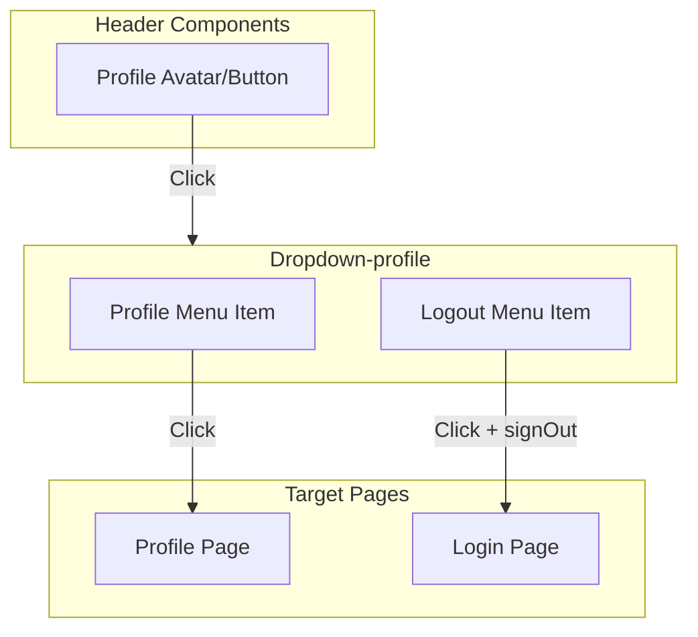

# Screen Flow Overview

## Project Info
- **Project Name**: Agentic Coding Hands-on
- **Figma File Key**: 9ypp4enmFmdK3YAFJLIu6C
- **Figma URL**: https://www.figma.com/design/9ypp4enmFmdK3YAFJLIu6C
- **Created**: 2026-03-13
- **Last Updated**: 2026-03-13

---

## Discovery Progress

| Metric | Count |
|--------|-------|
| Total Screens | 1 |
| Discovered | 1 |
| Remaining | 0 |
| Completion | 100% |

---

## Screens

| # | Screen Name | Frame ID | Figma Link | Status | Detail File | Predicted APIs | Navigations To |
|---|-------------|----------|------------|--------|-------------|----------------|----------------|
| 1 | Dropdown-profile | 721:5223 | [Figma](https://www.figma.com/design/9ypp4enmFmdK3YAFJLIu6C?node-id=721:5223) | discovered | [dropdown-profile.md](screens/dropdown-profile.md) | Supabase Auth signOut | Profile Page, Login Page |

---

## Navigation Graph



---

## Screen Groups

### Group: Navigation Components
| Screen | Purpose | Entry Points |
|--------|---------|--------------|
| Dropdown-profile | User account actions (profile, logout) | Profile trigger button in header |

---

## API Endpoints Summary

| Endpoint | Method | Screens Using | Purpose |
|----------|--------|---------------|---------|
| Supabase Auth `signOut()` | POST | Dropdown-profile | Terminate user session |
| /profile | GET | Dropdown-profile (navigation target) | User profile page |

---

## Data Flow

```mermaid
flowchart LR
    subgraph Client["Frontend"]
        Header[Header Component]
        Dropdown[Profile Dropdown]
    end

    subgraph Auth["Supabase Auth"]
        Session[Session Manager]
    end

    subgraph Pages["Pages"]
        Profile[Profile Page]
        Login[Login Page]
    end

    Header -->|Toggle| Dropdown
    Dropdown -->|Navigate| Profile
    Dropdown -->|signOut()| Session
    Session -->|Session terminated| Login
```

---

## Technical Notes

### Authentication Flow
- Supabase Auth-based authentication
- Session managed via Supabase client SDK
- Logout uses `supabase.auth.signOut()`

### State Management
- Global state: Supabase Auth session (via React context or server-side)
- Local state: Dropdown open/close state (React useState)

### Routing
- Router: Next.js App Router
- Protected routes require authentication
- Dropdown is a global header component visible on all authenticated routes

---

## Discovery Log

| Date | Action | Screens | Notes |
|------|--------|---------|-------|
| 2026-03-13 | Initial discovery | Dropdown-profile | Profile dropdown menu with Profile and Logout actions |

---

## Next Steps

- [ ] Discover additional screens (Profile page, Login page, etc.)
- [ ] Verify navigation paths between screens
- [ ] Map all API endpoints
- [ ] Review with design team
