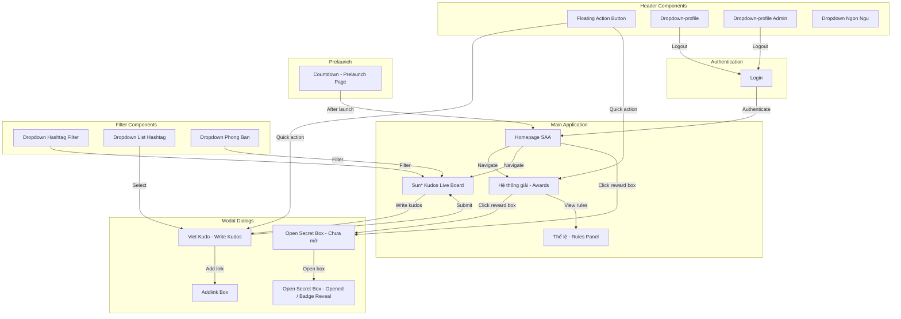
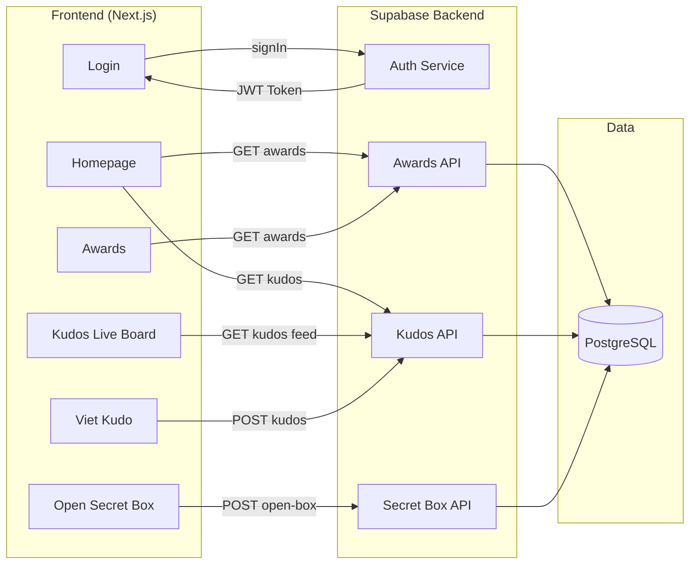

# Screen Flow Overview

## Project Info
- **Project Name**: Agentic Coding Hands-on
- **Figma File Key**: 9ypp4enmFmdK3YAFJLIu6C
- **Figma URL**: https://www.figma.com/design/9ypp4enmFmdK3YAFJLIu6C
- **Created**: 2026-03-13
- **Last Updated**: 2026-03-16

---

## Discovery Progress

| Metric | Count |
|--------|-------|
| Total Screens | 17 |
| Discovered | 17 |
| Remaining | 0 |
| Completion | 100% |

---

## Screens

| # | Screen Name | Frame ID | Figma Link | Status | Detail File | Predicted APIs | Navigations To |
|---|-------------|----------|------------|--------|-------------|----------------|----------------|
| 1 | Login | 662:14387 | [Figma](https://www.figma.com/design/9ypp4enmFmdK3YAFJLIu6C?node-id=662:14387) | discovered | [662-14387-Login](662-14387-Login/) | Supabase Auth signIn, Google OAuth | Homepage, Register |
| 2 | Countdown - Prelaunch Page | 2268:35127 | [Figma](https://www.figma.com/design/9ypp4enmFmdK3YAFJLIu6C?node-id=2268:35127) | discovered | [2-Countdown-Prelaunch-page](2-Countdown-Prelaunch-page/) | GET event config | Homepage (after launch) |
| 3 | Homepage SAA | 2167:9026 | [Figma](https://www.figma.com/design/9ypp4enmFmdK3YAFJLIu6C?node-id=2167:9026) | discovered | [2167-9026-Homepage-SAA](2167-9026-Homepage-SAA/) | GET awards, GET kudos | Awards, Kudos, Open Secret Box, Profile Dropdown |
| 4 | Hệ thống giải (Awards System) | 313:8436 | [Figma](https://www.figma.com/design/9ypp4enmFmdK3YAFJLIu6C?node-id=313:8436) | discovered | [313-8436-he-thong-giai](313-8436-he-thong-giai/) | GET awards list | Open Secret Box, Homepage |
| 5 | Thể lệ UPDATE (Rules Panel) | 3204:6051 | [Figma](https://www.figma.com/design/9ypp4enmFmdK3YAFJLIu6C?node-id=3204:6051) | discovered | [3204_6051-the-le-update](3204_6051-the-le-update/) | GET rules content | Awards page |
| 6 | Sun* Kudos - Live Board | 2940:13431 | [Figma](https://www.figma.com/design/9ypp4enmFmdK3YAFJLIu6C?node-id=2940:13431) | discovered | [2940-13431-sun-kudos-live-board](2940-13431-sun-kudos-live-board/) | GET kudos live feed | Homepage, Viet Kudo |
| 7 | Viet Kudo (Write Kudos) | 520:11602 | [Figma](https://www.figma.com/design/9ypp4enmFmdK3YAFJLIu6C?node-id=520:11602) | discovered | [520-11602-Viet-Kudo](520-11602-Viet-Kudo/) | POST kudos | Kudos Live Board |
| 8 | Open Secret Box (Chưa mở) | 1466:7676 | [Figma](https://www.figma.com/design/9ypp4enmFmdK3YAFJLIu6C?node-id=1466:7676) | discovered | [1466_7676-open-secret-box-chua-mo](1466_7676-open-secret-box-chua-mo/) | POST open-box | Open Secret Box (Opened/Badge Reveal) |
| 9 | Addlink Box | 1002:12917 | [Figma](https://www.figma.com/design/9ypp4enmFmdK3YAFJLIu6C?node-id=1002:12917) | discovered | [1-Addlink-Box](1-Addlink-Box/) | POST add-link | Viet Kudo |
| 10 | Floating Action Button | 313:9137 | [Figma](https://www.figma.com/design/9ypp4enmFmdK3YAFJLIu6C?node-id=313:9137) | discovered | [313_9137-floating-action-button](313_9137-floating-action-button/) | None | Viet Kudo, Awards |
| 11 | Dropdown-profile | 721:5223 | [Figma](https://www.figma.com/design/9ypp4enmFmdK3YAFJLIu6C?node-id=721:5223) | discovered | [721_5223-dropdown-profile](721_5223-dropdown-profile/) | Supabase Auth signOut | Profile Page, Login |
| 12 | Dropdown-profile (variant) | 721:5223 | [Figma](https://www.figma.com/design/9ypp4enmFmdK3YAFJLIu6C?node-id=721:5223) | discovered | [721-5223-Dropdown-profile](721-5223-Dropdown-profile/) | Supabase Auth signOut | Profile Page, Login |
| 13 | Dropdown-profile Admin | 721:5277 | [Figma](https://www.figma.com/design/9ypp4enmFmdK3YAFJLIu6C?node-id=721:5277) | discovered | [721-5277-Dropdown-profile-Admin](721-5277-Dropdown-profile-Admin/) | Supabase Auth signOut | Admin Panel, Profile, Login |
| 14 | Dropdown Ngon Ngu (Language) | 721:4942 | [Figma](https://www.figma.com/design/9ypp4enmFmdK3YAFJLIu6C?node-id=721:4942) | discovered | [721_4942-dropdown-ngon-ngu](721_4942-dropdown-ngon-ngu/) | PUT locale preference | Current page (reload) |
| 15 | Dropdown Hashtag Filter | 721:5580 | [Figma](https://www.figma.com/design/9ypp4enmFmdK3YAFJLIu6C?node-id=721:5580) | discovered | [3-Dropdown-Hashtag-filter](3-Dropdown-Hashtag-filter/) | GET hashtags | Kudos list (filtered) |
| 16 | Dropdown List Hashtag | 1002:13013 | [Figma](https://www.figma.com/design/9ypp4enmFmdK3YAFJLIu6C?node-id=1002:13013) | discovered | [4-Dropdown-list-hashtag](4-Dropdown-list-hashtag/) | GET hashtags | Viet Kudo (selection) |
| 17 | Dropdown Phong Ban (Department) | 721:5684 | [Figma](https://www.figma.com/design/9ypp4enmFmdK3YAFJLIu6C?node-id=721:5684) | discovered | [721-5684-Dropdown-Phong-ban](721-5684-Dropdown-Phong-ban/) | GET departments | Kudos list (filtered) |

---

## Navigation Graph

---

## Screen Groups

### Group: Authentication
| Screen | Purpose | Entry Points |
|--------|---------|--------------|
| Login | User authentication via email/Google OAuth | App launch, Logout |

### Group: Prelaunch
| Screen | Purpose | Entry Points |
|--------|---------|--------------|
| Countdown - Prelaunch Page | Countdown timer before event starts | Direct URL before launch |

### Group: Main Pages
| Screen | Purpose | Entry Points |
|--------|---------|--------------|
| Homepage SAA | Main hub with awards overview and kudos feed | After login |
| Hệ thống giải (Awards) | Awards system listing all categories | Homepage, FAB |
| Thể lệ (Rules Panel) | Event rules and guidelines | Awards page |
| Sun* Kudos Live Board | Real-time kudos feed | Homepage navigation |

### Group: Modal Dialogs
| Screen | Purpose | Entry Points |
|--------|---------|--------------|
| Open Secret Box (Chưa mở) | Modal for opening secret reward boxes (unopened state) | Awards page, Homepage |
| Viet Kudo (Write Kudos) | Modal form to compose and send a kudos | FAB, Kudos Live Board |
| Addlink Box | Modal to attach links when writing kudos | Viet Kudo modal |

### Group: Header / Navigation Components
| Screen | Purpose | Entry Points |
|--------|---------|--------------|
| Floating Action Button | Quick access to key actions | Visible on all authenticated pages |
| Dropdown-profile | User profile menu with logout | Header avatar click |
| Dropdown-profile Admin | Admin variant of profile menu | Header avatar click (admin users) |
| Dropdown Ngon Ngu (Language) | Language switcher | Header language button |

### Group: Filter Components
| Screen | Purpose | Entry Points |
|--------|---------|--------------|
| Dropdown Hashtag Filter | Filter kudos by hashtags | Kudos Live Board |
| Dropdown List Hashtag | Select hashtags for kudos | Viet Kudo modal |
| Dropdown Phong Ban (Department) | Filter by department | Kudos Live Board |

---

## API Endpoints Summary

| Endpoint | Method | Screens Using | Purpose |
|----------|--------|---------------|---------|
| Supabase Auth `signInWithPassword()` | POST | Login | Email/password authentication |
| Supabase Auth `signInWithOAuth()` | POST | Login | Google OAuth authentication |
| Supabase Auth `signOut()` | POST | Dropdown-profile, Dropdown-profile Admin | Terminate user session |
| GET awards | GET | Homepage, Awards | Fetch award categories |
| GET kudos feed | GET | Homepage, Kudos Live Board | Fetch kudos list |
| POST kudos | POST | Viet Kudo | Submit a new kudos |
| POST open-box | POST | Open Secret Box (Chưa mở) | Open a secret reward box |
| GET hashtags | GET | Hashtag Filter, Hashtag List | Fetch available hashtags |
| GET departments | GET | Dropdown Phong Ban | Fetch department list |
| POST add-link | POST | Addlink Box | Attach link to kudos |
| GET rules | GET | Thể lệ (Rules Panel) | Fetch event rules content |
| PUT locale | PUT | Dropdown Ngon Ngu | Update language preference |

---

## Data Flow

---

## Technical Notes

### Authentication Flow
- Supabase Auth-based authentication
- Supports email/password and Google OAuth
- Session managed via Supabase client SDK
- Logout uses `supabase.auth.signOut()`

### State Management
- Global state: Supabase Auth session (via React context or server-side)
- Local state: Component-level React useState for dropdowns, modals
- Server state: Next.js server components + Supabase queries

### Routing
- Router: Next.js App Router
- Protected routes require authentication
- Modal dialogs overlay on current page without route change
- Open Secret Box modal triggered from Awards or Homepage context

### Open Secret Box Modal
- **Frame**: "Open secret box- chưa mở" (1466:7676)
- Displays an unopened secret reward box
- User clicks to open the box, triggering a POST request
- After opening, transitions to the "opened" state showing the revealed badge/reward
- Triggered from Awards page or Homepage when user has available boxes

---

## Discovery Log

| Date | Action | Screens | Notes |
|------|--------|---------|-------|
| 2026-03-13 | Initial discovery | Dropdown-profile | Profile dropdown menu with Profile and Logout actions |
| 2026-03-16 | Full catalog | All 17 screens | Cataloged all spec directories including Open Secret Box modal |

---

## Next Steps

- [ ] Discover the "Open Secret Box - opened" state (badge reveal frame)
- [ ] Map detailed API request/response schemas
- [ ] Verify navigation paths with end-to-end flow testing
- [ ] Review with design team
